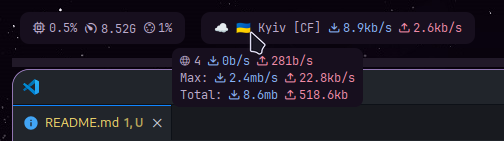

# Hiddibar

A simple Hiddify status bar module for Waybar.



## Features

- Active profile name
- Tooltip
  - Connection count
  - Download speed
  - Upload speed
  - Max download speed
  - Max upload speed
  - Total download
  - Total upload

## Installation

1. Compile using `cargo build --release`, or download the binary from the [releases](https://github.com/MrYuto/hiddibar/releases/latest) page.
2. Copy Hiddify data directory path (i.e., `~/.local/share/app.hiddify.com/` on linux)

### Waybar config

```json
  "custom/hiddibar": {
    "tooltip": true,
    "exec": "/path/to/hiddibar --directory /path/to/data",
    "return-type": "json",
  }
```

## Usage

```sh
Usage: hiddibar [OPTIONS] --directory <DIRECTORY>

Options:
  -d, --directory <DIRECTORY>  Hiddify data directory path
  -i, --interval <INTERVAL>    Update interval in seconds [default: 1]
      --dl-color <DL_COLOR>    Download stats color [default: #B985FA]
      --up-color <UP_COLOR>    Upload stats color [default: #FA699B]
  -p, --pattern <PATTERN>      Filter profile name based on a regex
  -h, --help                   Print help
  -V, --version                Print version
```